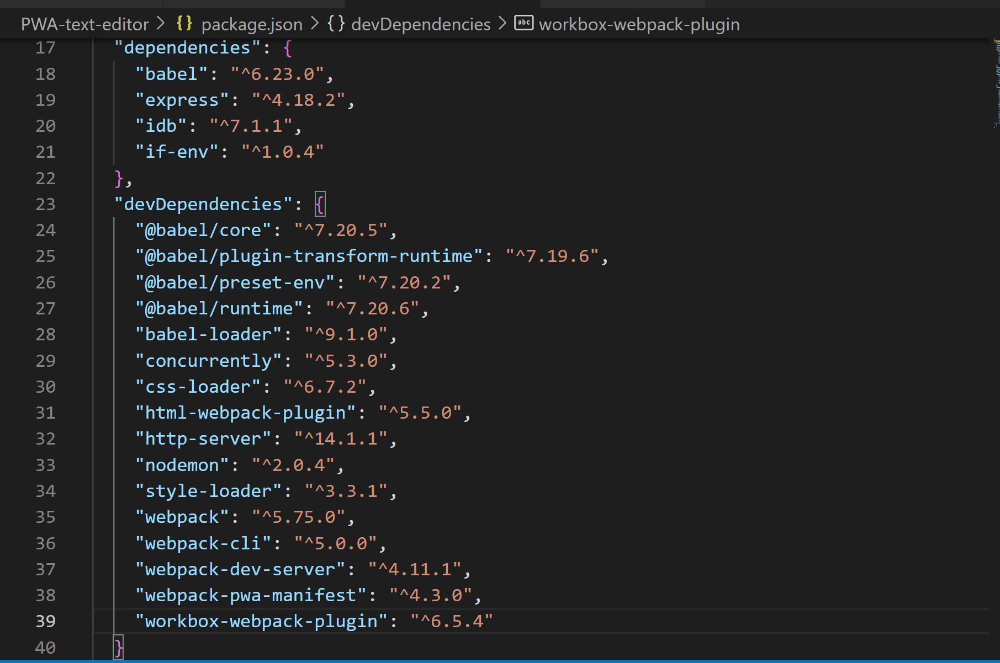
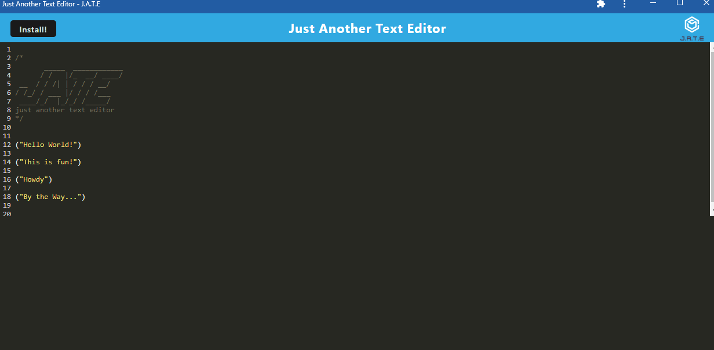

# Text Editor Starter Code

# User Story
AS A developer
I WANT to create notes or code snippets with or without an internet connection
SO THAT I can reliably retrieve them for later use

## Table of Contents
  * [Description](#description)
  * [Usage](#usefaq)
  * [Installation](#install)
  * [Run](#run)
  * [Dependencies](#dependencies)
  * [Technology Used](#techno)
  * [Demo](#demo)
  * [Testing](#test)
  * [License](#license)
  * [Contributing to this Repo](#contributing)
  * [Questions / Contact Details](#questions)

  
  ## Description
  This is a Progressive Web Application.  It is a text editor app that runs in the browser and also functions offline.

  Built with an existing application and implement methods for getting and storing data to an IndexedDB database.

  
  ## Usage
  Can be installed as a Progressive web Application.

  
  ## Installation   
    Please use npm install to install dependencies.  Includes:
  * 
  * npm i idb ( A lightweight wrapper around the IndexedDB API)

  
  ## Run
  npm run start

  
  ## Dependencies
     
     
    * "babel": "^6.23.0",
    * "express": "^4.18.2",
    * "idb": "^7.1.1",
    * "if-env": "^1.0.4"
  
  "devDependencies": {
    * "@babel/core": "^7.20.5",
    * "@babel/ plugin-transform-runtime": "^7.19.6",
    * "@babel/preset-env": "^7.20.2",
    * "@babel/runtime": "^7.20.6",
    * "babel-loader": "^9.1.0",
    * "concurrently": "^5.3.0",
    * "css-loader": "^6.7.2",
    * "html-webpack-plugin": "^5.5.0",
    * "http-server": "^14.1.1",
    * "nodemon": "^2.0.4",
    * "style-loader": "^3.3.1",
    * "webpack": "^5.75.0",
    * "webpack-cli": "^5.0.0",
    * "webpack-dev-server": "^4.11.1",
    * "webpack-pwa-manifest": "^4.3.0",
    * "workbox-webpack-plugin": "^6.5.4"
  }
}
  
  
  ## Technologies Used
  * Javascript
  * Node.js
  * Express.js
  * Webpack
  * Workbox
  * Babel
  * Idb
  * Concurrently

  
  ## Demo
  

  The application is deployed [here](https://pwa-jate-mystic-app.herokuapp.com/)

  
  ## License
  The application is covered under a MIT license.

  
  ## Contributing to this Repo
  Please [email](smilligan0183@gmail.com) me if you'd like to contribute

  
  ## Questions / Contact Details
  This app can be found on my github page at [Sara-Mill](https://github.com/Sara-Mill).
  

  If you have any questions or need to contact me about this app, I can be reached on [Github](https://github.com/Sara-Mill) or by [email](smilligan0183@gmail.com)